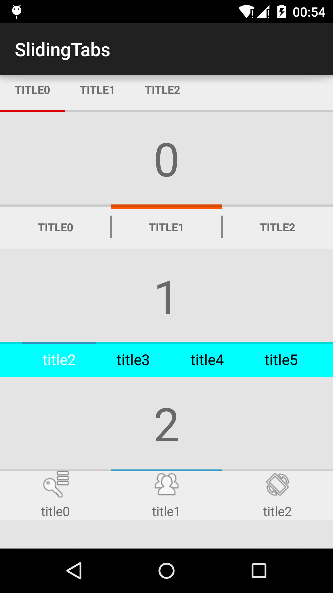

#SlidingTabs

SlidingTabs from [google android samples](http://developer.android.com/samples/SlidingTabsBasic/index.html)

##added method

set tabs fill the viewport

    SlidingTabLayout#setDistributeEvenly(boolean)

draw indicator bar [TOP|BOTTOM]

    setIndicatorBarGravity(int indicatorBarGravity)

whether draw divider or not

    setDividerEnable(boolean enable)

customize tabstrip size

    setmCustomTabSizer(SlidingTabLayout.TabSizer tabSizer)

customize tabview

    setSlidingTabAdapter(SlidingTabAdapter slidingTabAdapter)

##demo

